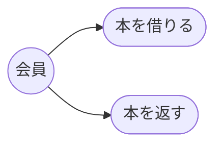
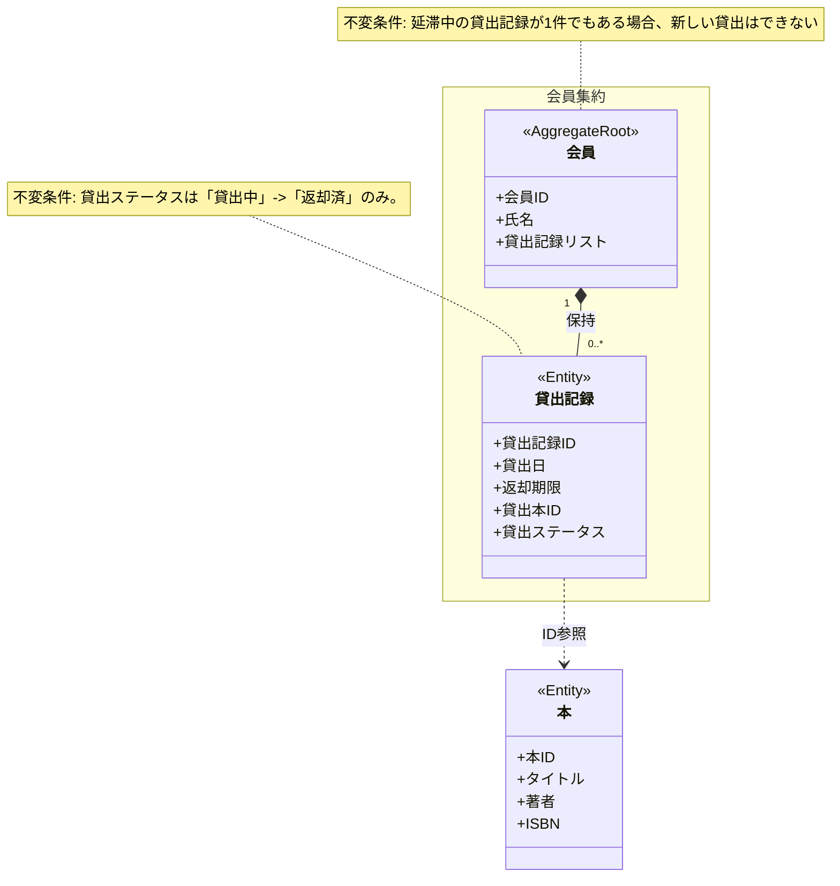
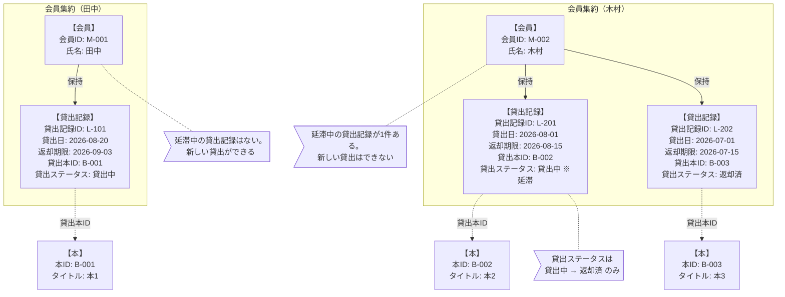

# Lv.1: 図書館の貸出システム — モデリング(SUDO)

要求文・ユビキタス言語は [docs.md](docs.md) を参照。
記法は [README.md](../README.md) の「モデリングの記法」を参照。

## S: システム関連図

(ここに関連図を書く)

## U: ユースケース図

| # | アクター | ユースケース | 概要 | 事前条件 | 事後条件 |
|---|----------|--------------|------|----------|----------|
|1|会員|本を借りる|会員が図書館から本を借りる。貸出日と返却期限（貸出日から14日後）を持つ貸出記録が作られる|延滞中の本が1冊もない|貸出記録が「貸出中」で追加される|
|2|会員|本を返す|会員が借りた本を図書館へ返却する|対象の貸出記録が「貸出中」である|貸出ステータスが「返却済」になる|

「本を借りる」は、延滞中の本が1冊でもある会員では実行できない。

## D: ドメインモデル図

## O: オブジェクト図

基準日: 2026-08-30。会員集約は枠で囲み、本は識別子参照のみ。吹き出しは不変条件の適用結果。

