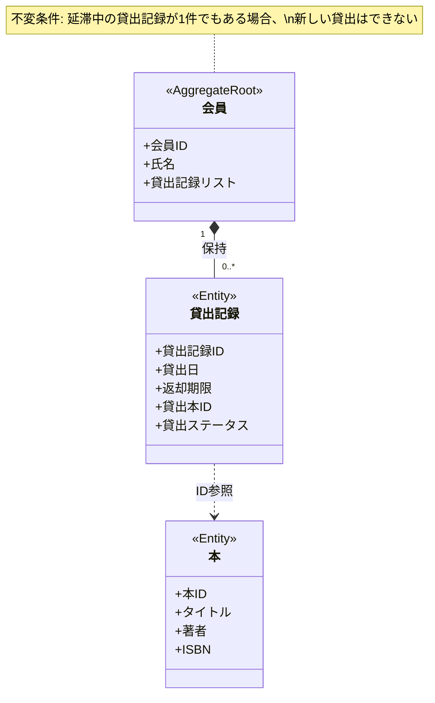

# Lv.1: 図書館の貸出システム — モデリング(SUDO)

要求文・ユビキタス言語は [docs.md](docs.md) を参照。
記法は [README.md](../README.md) の「モデリングの記法」を参照。

## S: システム関連図

(ここに関連図を書く)

## U: ユースケース図

(ここにユースケース図または一覧表を書く)

## D: ドメインモデル図

### 不変条件

| # | 内容 | 実現場所 |
|---|------|----------|
|1|- 延滞中の本が１冊でもある会員は新しく本を借りることができない - 貸出ステータスは「貸出中」->「返却済」のみ |会員|

## O: オブジェクト図

(ここに具体的なインスタンス例と吹き出しを書く)
